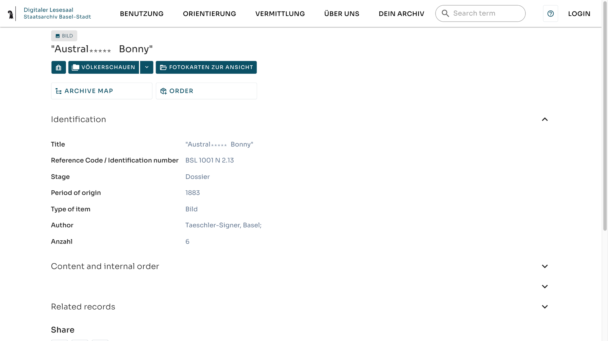



**Falltyp:** Ein historisch überlieferter Begriff ist heute diskriminierend. Spannungsfeld: Quellentreue gegen heutige Beschreibungspraxis.

## Ausgangsmaterial

{fig-alt="Screenshot des Digitalen Lesesaals des Staatsarchivs Basel-Stadt: Dossier BSL 1001 N 2.13 aus dem Bestand Völkerschauen. Der Titel enthält eine koloniale, rassistische Fremdbezeichnung; ein Teil des Wortes ist abgedeckt." width="100%"}

Der Datensatz enthält diese Angaben. Ein Teil des Begriffs ist hier mit \*\*\*\*\* abgedeckt.

::: {.datensatz}

| Feld                    | Wert                                      |
| :---------------------- | :---------------------------------------- |
| Title                   | \"Austral\*\*\*\*\* Bonny\"               |
| Reference Code          | BSL 1001 N 2.13                           |
| Stage                   | Dossier                                   |
| Period of origin        | 1883                                      |
| Type of item            | Bild                                      |
| Author                  | Taeschler-Signer, Basel;                  |
| Anzahl                  | 6                                         |
| Übergeordnete Einheiten | «Völkerschauen», «Fotokarten zur Ansicht» |

:::

Zum Vergleich: Ein weiterer Datensatz, BSL 1001 G 1.1.13.2, trägt ebenfalls den Namen «Bonny» im Titel. Dieser Titel lautet: Kletternder Maori \"Bonny\" [Austral\*\*\*\*\* \"Bonny\"].

Originaldatensatz: [dls.staatsarchiv.bs.ch/records/1007281](https://dls.staatsarchiv.bs.ch/records/1007281)

## Kontext

Der Digitale Lesesaal des Staatsarchivs Basel-Stadt macht Verzeichnungen und Digitalisate online zugänglich. Das Dossier ist der Einheit «Völkerschauen» zugeordnet.



## Arbeitsauftrag



**Fragen zu diesem Fall:**

- Auf welcher Ebene steht der Begriff: Quelle, Titel der Verzeichnung, Suchindex?
- Was zeigen die Anführungszeichen im Titel an? Erkennen Nutzende das?
- Die beiden Datensätze behandeln den Begriff unterschiedlich. Welche Lösung überzeugt Sie mehr? Warum?
- Wer sollte über eine neue Bezeichnung mitentscheiden?
