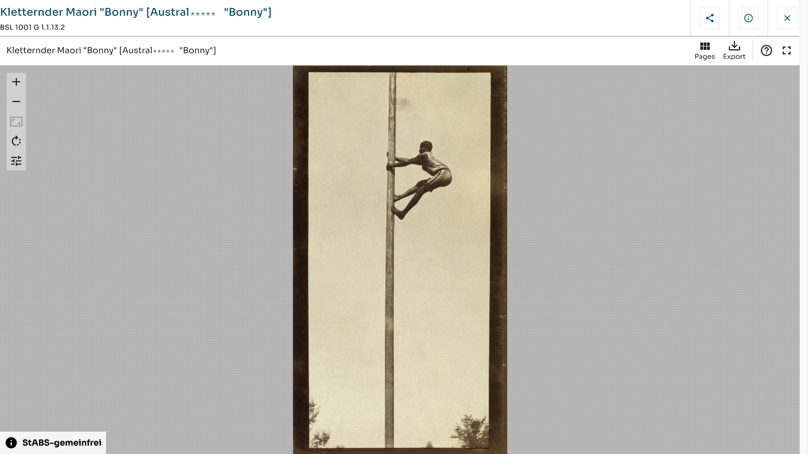



**Falltyp:** Metadaten oder Digitalisate enthalten Informationen, deren Veröffentlichung oder Nachnutzung Personen oder Gruppen schaden kann.

## Ausgangsmaterial

{fig-alt="Screenshot des Digitalen Lesesaals des Staatsarchivs Basel-Stadt: Fotografie eines Mannes, der an einem Mast hochklettert, Signatur BSL 1001 G 1.1.13.2. Der Titel enthält eine koloniale, rassistische Fremdbezeichnung; ein Teil des Wortes ist abgedeckt." width="100%"}

Der Viewer zeigt diese Angaben. Ein Teil des Begriffs ist hier mit \*\*\*\*\* abgedeckt.

::: {.datensatz}

| Element       | Inhalt                                                    |
| :------------ | :-------------------------------------------------------- |
| Titel         | Kletternder Maori \"Bonny\" [Austral\*\*\*\*\* \"Bonny\"] |
| Signatur      | BSL 1001 G 1.1.13.2                                       |
| Bild          | Fotografie eines Mannes, der an einem Mast hochklettert   |
| Rechtehinweis | StABS-gemeinfrei                                          |
| Funktionen    | Pages, Export                                             |

:::

Originaldatensatz: [dls.staatsarchiv.bs.ch/records/439319](https://dls.staatsarchiv.bs.ch/records/439319/26232/preview?context=%2Frecords%2F1007281)

## Kontext

Die Fotografie steht im Digitalen Lesesaal des Staatsarchivs Basel-Stadt im Zusammenhang mit Völkerschauen. Die Fallkarte [Historische Bezeichnung](fall-2-historische-bezeichnung.qmd) zeigt ein Dossier mit demselben Namen «Bonny» im Titel.



## Arbeitsauftrag



**Fragen zu diesem Fall:**

- Was bedeutet «gemeinfrei» rechtlich? Was bedeutet es ethisch?
- Konnte die abgebildete Person über die Aufnahme und ihre Veröffentlichung mitentscheiden?
- Welche Schäden können durch Veröffentlichung, Export und Nachnutzung entstehen? Für wen?
- Welche Handlungsoptionen gibt es zwischen «frei zugänglich» und «gesperrt»?
- Wer sollte an dieser Entscheidung beteiligt sein?
