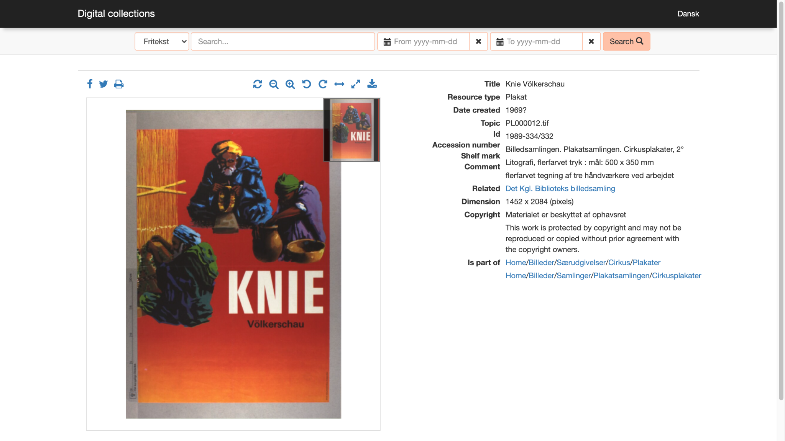
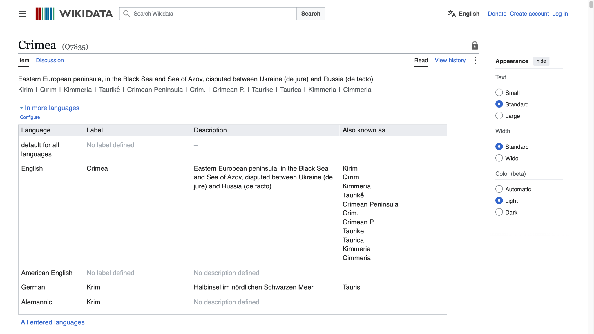
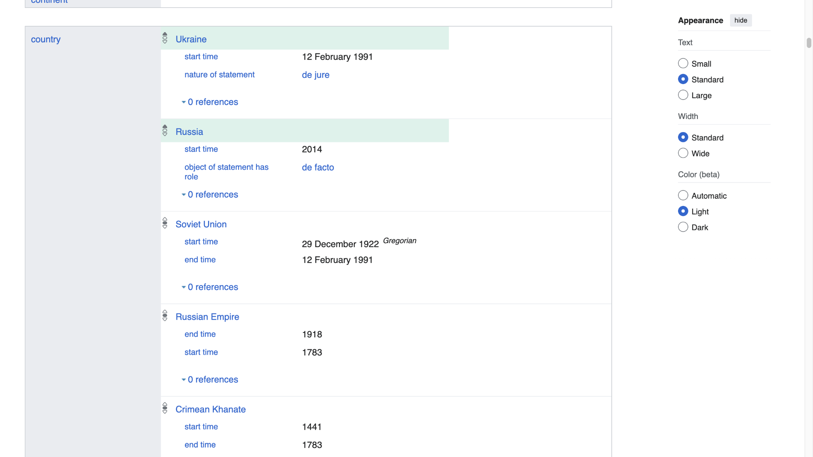
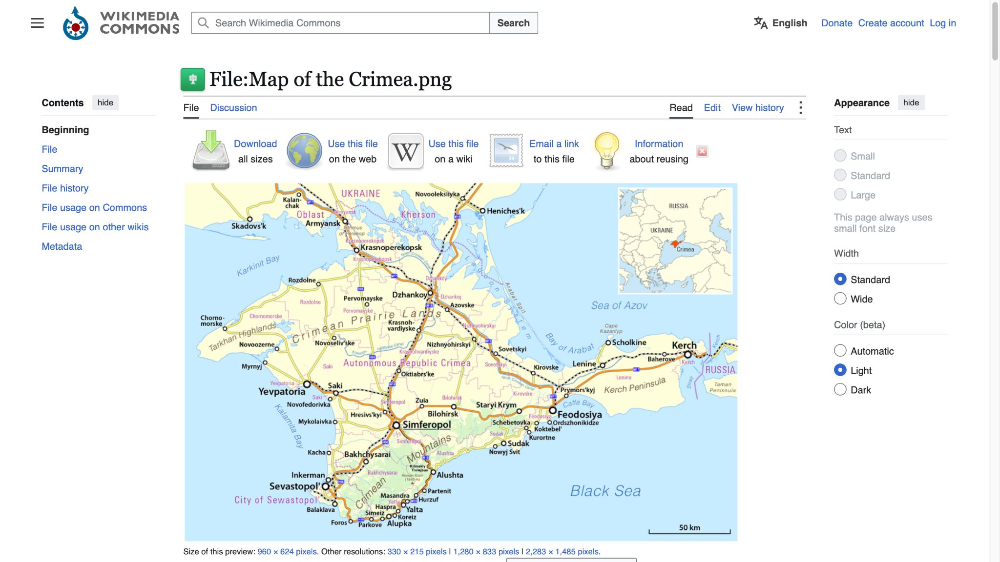
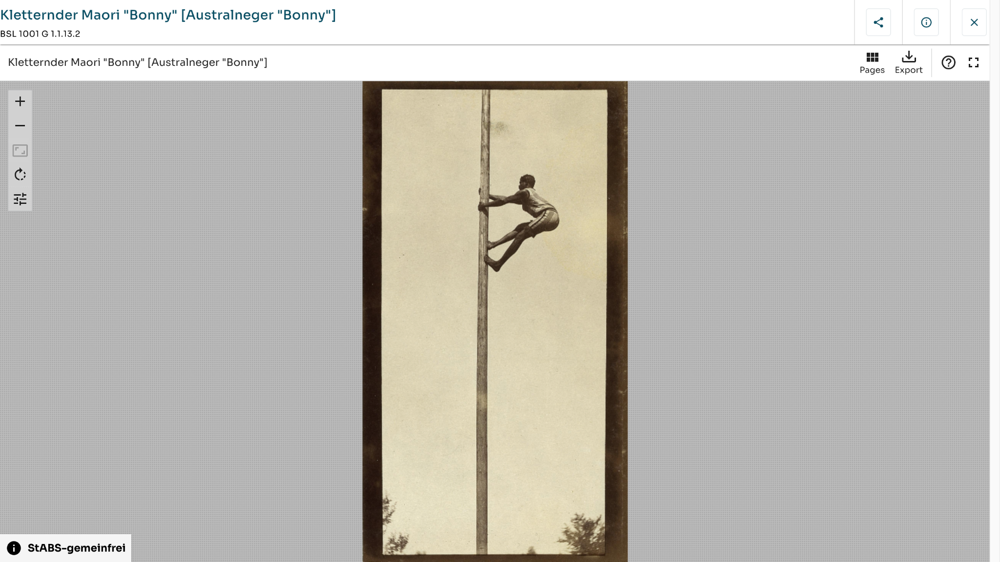
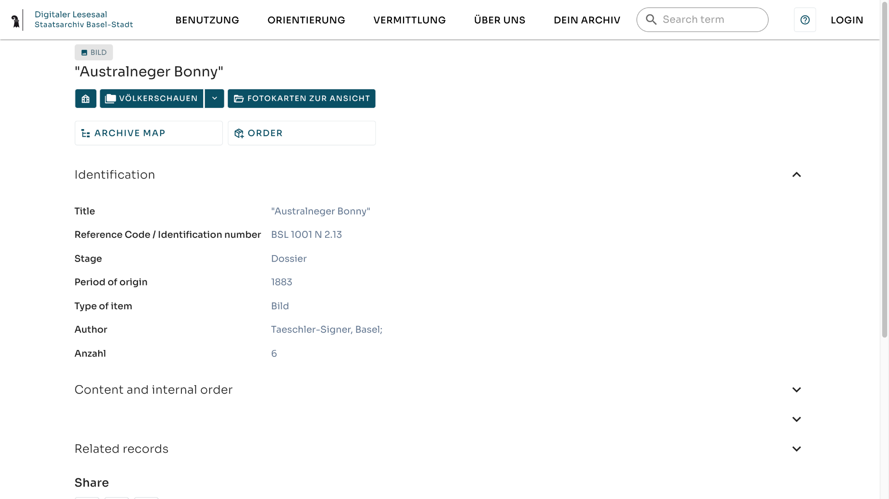
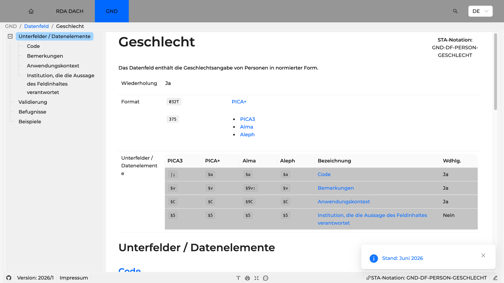
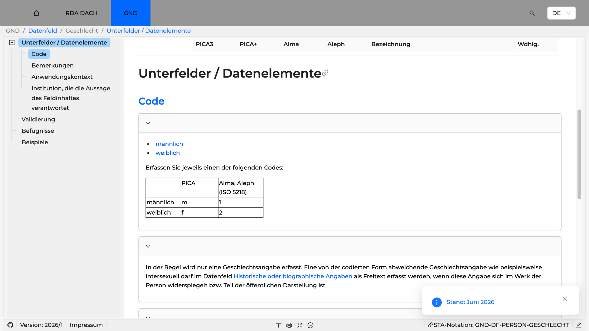
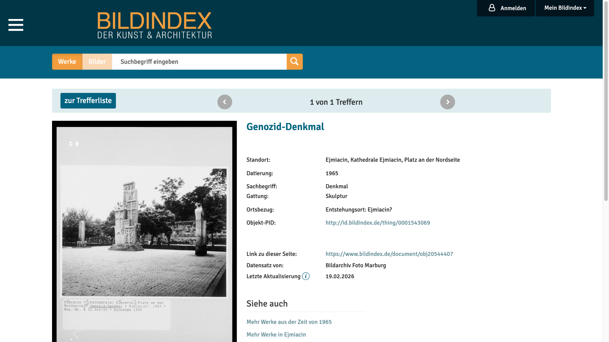

## Setting the scene {.shot}

{.shot-img fig-alt="Screenshot der Digitalen Sammlungen der Königlichen Bibliothek Kopenhagen: Plakat «Knie Völkerschau», Lithografie, um 1969."}

::: {.source}
[digitalesamlinger.kb.dk](https://digitalesamlinger.kb.dk/images/billed/2010/okt/billeder/object488811/en/)
:::

::: notes
Setting the scene
:::

# Daten sind nicht neutral {.center}

[Data is not neutral]{.en}

## Normativität {.bias}

[[Normativity]{} [Grundlage]{.tag}]{.term}

:::: {.columns}
::: {.column width="50%"}
::: {.def}
Daten und Metadaten erscheinen auf den ersten Blick als objektive Repräsentationen der Wirklichkeit, doch sind sie stets in historisch gewachsene Machtverhältnisse und normative Ordnungen eingebettet.
:::

Jede Form von Daten- und Metadatenmodellierung – sei sie visuell, textuell oder strukturell – beruht auf normativen Entscheidungen, die oft unsichtbar bleiben.
:::
::: {.column width="50%"}
::: {.quote}
«invisible hand of classification»

[Bowker und Star 1999]{.cite}
:::

::: {.example}
[«Technische Neutralität»]{.label}
Entscheidungen in Interface, Datenmodell und Standardisierung erscheinen als rein technische Notwendigkeiten, obwohl sie normative Setzungen enthalten.
:::
:::
::::

## Krim in Wikidata: Bezeichnungen {.shot}

{.shot-img fig-alt="Screenshot von Wikidata, Objekt Crimea (Q7835): Beschreibung «disputed between Ukraine (de jure) and Russia (de facto)» und Bezeichnungen in mehreren Sprachen."}

::: {.source}
[wikidata.org/wiki/Q7835](https://www.wikidata.org/wiki/Q7835)
:::

::: notes
Data are not neutral
:::

## Krim in Wikidata: Staatszugehörigkeit {.shot}

{.shot-img fig-alt="Screenshot von Wikidata, Objekt Crimea (Q7835), Eigenschaft «country»: Ukraine ab 1991 (de jure), Russland ab 2014 (de facto), Sowjetunion, Russisches Kaiserreich, Krim-Khanat."}

::: {.source}
[wikidata.org/wiki/Q7835](https://www.wikidata.org/wiki/Q7835)
:::

## Karte der Krim auf Wikimedia Commons {.shot}

{.shot-img fig-alt="Screenshot von Wikimedia Commons: Datei «Map of the Crimea.png», eine Karte der Halbinsel Krim mit Städten, Strassen und Grenzen."}

::: {.source}
[commons.wikimedia.org/wiki/File:Map_of_the_Crimea.png](https://commons.wikimedia.org/wiki/File:Map_of_the_Crimea.png) · Karte: Maximilian Dörrbecker (Chumwa), CC BY-SA 2.0
:::

## Das Beispiel Krim {.bias}

:::: {.columns}
::: {.column width="50%"}
[Was das Beispiel zeigt]{.colhead}

- Wikidata führt die Krim sowohl als Teil der Ukraine (“de jure”) als auch Russlands (“de facto”).
- Viele verknüpfte Objekte wie Städte oder administrative Einheiten übernehmen diese Mehrdeutigkeit nicht konsistent oder bilden einzig die ukrainische Perspektive ab.
- Die Karte operiert mit einem klaren Framing zugunsten der ukrainischen Souveränität und blendet alternative Klassifikationsoptionen, wie etwa die Bezeichnung “Republik Krim” als Teil Russlands, weitgehend aus.
:::
::: {.column width="50%"}
[In der Umsetzung]{.colhead}

::: {.kern}
1. Transparente Dokumentation von Modellierungsentscheidungen (Schema, Version, Geltungsbereich)
2. Parallele Felder für Mehrperspektivität (*de jure*/*de facto*, Selbst- und Fremdbezeichnungen)
3. Überprüfbare Quellen- und Provenienzangaben
4. Explizite, maschinenlesbare Markierung von Konflikten und Unsicherheiten (Status, Zeitraum, räumliche Gültigkeit)
:::
:::
::::

# Direkte Diskriminierung {.center}

[Direct Discrimination]{.en}

## Direkte Diskriminierung {.bias}

[[Direct Discrimination]{} [Diskriminierung · 1 / 6]{.tag}]{.term}

:::: {.columns}
::: {.column width="45%"}
::: {.def}
Eine Regel, Entscheidung oder Handlung ist **direkt diskriminierend**, wenn sie Personen aufgrund eines geschützten Merkmals ungleich behandelt und diese Ungleichbehandlung nicht durch einen legitimen, verhältnismässigen Zweck gedeckt ist.
:::

:::
::: {.column width="55%"}
[Kernelemente]{.colhead}

::: {.kern}
1. **Unmittelbare Ungleichbehandlung:** Eine Regel oder Praxis behandelt Personen explizit unterschiedlich.
2. **Merkmalsbezug:** Die Ungleichbehandlung knüpft an ein tatsächliches oder zugeschriebenes (geschütztes) Merkmal an.
3. **Fehlende Rechtfertigung:** Es gibt keinen legitimen, verhältnismässigen Zweck, der die Ungleichbehandlung trägt.
:::
:::
::::

## Staatsarchiv Basel-Stadt: BSL 1001 G 1.1.13.2 {.shot}

{.shot-img fig-alt="Screenshot des Digitalen Lesesaals des Staatsarchivs Basel-Stadt: Fotografie eines Mannes, der an einem Mast hochklettert, Signatur BSL 1001 G 1.1.13.2. Der Titel enthält eine koloniale, rassistische Fremdbezeichnung; ein Teil des Wortes ist auf der Folie abgedeckt."}

::: {.censor style="left:358px; top:-7px; width:67px; height:30px; font-size:20px; color:#0a5065;"}
\*\*\*\*\*
:::

::: {.censor style="left:281px; top:74px; width:54px; height:24px; font-size:16px; color:#212121;"}
\*\*\*\*\*
:::

::: {.source}
[dls.staatsarchiv.bs.ch](https://dls.staatsarchiv.bs.ch/records/439319/26232/preview?context=%2Frecords%2F1007281)
:::

## Staatsarchiv Basel-Stadt: BSL 1001 N 2.13 {.shot}

{.shot-img fig-alt="Screenshot des Digitalen Lesesaals des Staatsarchivs Basel-Stadt: Dossier BSL 1001 N 2.13 aus dem Bestand Völkerschauen, Entstehungszeit 1883, Autor Taeschler-Signer, Basel. Der Titel enthält eine koloniale, rassistische Fremdbezeichnung; ein Teil des Wortes ist auf der Folie abgedeckt."}

::: {.censor style="left:210px; top:102px; width:79px; height:33px; font-size:23px; color:#212121;"}
\*\*\*\*\*
:::

::: {.censor style="left:543px; top:368px; width:54px; height:23px; font-size:16px; color:#61758f;"}
\*\*\*\*\*
:::

::: {.source}
[dls.staatsarchiv.bs.ch](https://dls.staatsarchiv.bs.ch/records/1007281)
:::

# Indirekte Diskriminierung {.center}

[Indirect Discrimination]{.en}

## Indirekte Diskriminierung {.bias}

[[Indirect Discrimination]{} [Diskriminierung · 2 / 6]{.tag}]{.term}

:::: {.columns}
::: {.column width="45%"}
::: {.def}
**Indirekte Diskriminierung** liegt vor, wenn formal neutrale Kriterien, Methoden oder Regelungen zur Erhebung, Auswahl, Beschreibung oder Interpretation historischer Daten in ihrer Wirkung systematisch bestimmte Gruppen benachteiligen.
:::

Das betrifft zum Beispiel unterdokumentierte Gruppen oder Praktiken, die durch etablierte Routineprozesse weiter marginalisiert werden.

:::
::: {.column width="55%"}
[Kernelemente]{.colhead}

::: {.kern}
1. **Formale Neutralität:** Kriterien oder Prozesse wirken auf den ersten Blick allgemeingültig.
2. **Ungleichwirkung:** In der Anwendung entstehen systematische Nachteile für bestimmte Gruppen (Disparate Impact).
3. **Alternative Gestaltung:** Es gäbe weniger benachteiligende, fachlich gleichwertige Verfahren oder Ausnahmen.
:::
:::
::::

## Élites suisses: Index des personnes {.shot}

{.shot-img fig-alt="Screenshot der Datenbank Élites suisses: Index des personnes, alphabetisch nach Nachname sortiert, mit Spalten Nom, Prénom, Dates, Mandats und Projet."}

::: {.source}
[elitessuisses.unil.ch](https://elitessuisses.unil.ch/indexPersonnes.php)
:::

::: notes
Auf der von dir verlinkten Personen-Indexseite selbst offenbar nicht direkt. Dort wird alphabetisch nur nach dem Feld „Nom“ (Nachname) aufgelistet; ein separates Feld oder Filter für Geburts-/Ledignamen gibt es dort nicht. elitessuisses.unil.ch

Die Datenbank enthält Ledignamen aber teilweise. Beispielsweise steht dort:

Stefanie Engel (née Kirchhoff) elitessuisses.unil.ch

Renée Noverraz (née Alivon) elitessuisses.unil.ch

Die Startseite hat zudem eine allgemeine Suche nach Personen und Entitäten. elitessuisses.unil.ch Ich konnte aber nicht eindeutig verifizieren, ob diese Suche das Feld „née …“ systematisch mitindexiert.

Als zuverlässigen Workaround kannst du bei Google/Bing z. B. suchen:

site:elitessuisses.unil.ch "née Müller"

oder genauer:

site:elitessuisses.unil.ch/p/ "née Müller"

Damit lassen sich zumindest die öffentlich angezeigten Ledignamen finden.

Wenn du möchtest, kann ich auch untersuchen, wie man alle Frauen samt Ledignamen aus der gesamten Élites-Suisses-Datenbank systematisch herausbekommt (z. B. als Liste/CSV).
:::

# Strukturelle Diskriminierung {.center}

[Structural Discrimination]{.en}

## Strukturelle Diskriminierung {.bias}

[[Structural Discrimination]{} [Diskriminierung · 3 / 6]{.tag}]{.term}

:::: {.columns}
::: {.column width="45%"}
::: {.def}
**Strukturelle Diskriminierung** bezeichnet Benachteiligungen, die in etablierten Praktiken der Sammlung, Dokumentation, Bewahrung und Zugänglichmachung verankert sind.
:::

Ordnungen des Archivierens, Katalogisierens und Kuratierens reproduzieren häufig patriarchale, koloniale und heteronormative Sichtweisen.

<!-- Zahlreiche digitale Infrastrukturen orientieren Sprache, Usability und Standards primär an westlichen Forschungstraditionen; indigene und nicht-westliche Perspektiven bleiben dadurch marginalisiert. -->

:::
::: {.column width="55%"}
[Kernelemente]{.colhead}

::: {.kern}
1. **Einbettung in Routinen und Infrastrukturen:** Benachteiligungen entstehen nicht primär durch einzelne Akte, sondern durch gewachsene Standards, Prozesse und Klassifikationen.
2. **Kumulativität und Pfadabhängigkeit:** Viele kleine Entscheidungen verstärken sich über Zeit und werden schwer revidierbar.
3. **Unsichtbarkeit als Normalform:** Ungleichheiten erscheinen als “Datenlage” oder “Sachzwang” und werden dadurch stabilisiert.
:::
:::
::::

## GND: Datenfeld Geschlecht {.shot}

{.shot-img fig-alt="Screenshot der Standardisierungsdokumentation der Deutschen Nationalbibliothek: GND-Datenfeld «Geschlecht», das die Geschlechtsangabe von Personen in normierter Form enthält."}

::: {.source}
[sta.dnb.de/doc/GND-DF-PERSON-GESCHLECHT](https://sta.dnb.de/doc/GND-DF-PERSON-GESCHLECHT)
:::

## GND: Codes für Geschlecht {.shot}

{.shot-img fig-alt="Screenshot der GND-Dokumentation, Unterfeld Code: nur «männlich» und «weiblich» sind als Codes vorgesehen. Eine abweichende Angabe wie intersexuell darf nur als Freitext in einem anderen Datenfeld erfasst werden."}

::: {.source}
[sta.dnb.de/doc/GND-DF-PERSON-GESCHLECHT](https://sta.dnb.de/doc/GND-DF-PERSON-GESCHLECHT)
:::

# Institutionelle Diskriminierung {.center}

[Institutional Discrimination]{.en}

## Institutionelle Diskriminierung {.bias}

[[Institutional Discrimination]{} [Diskriminierung · 4 / 6]{.tag}]{.term}

:::: {.columns}
::: {.column width="45%"}
::: {.def}
**Institutionelle Diskriminierung** entsteht, wenn interne Ordnungen und Routinen von einer spezifischen Gedächtnisinstitution systematisch bestimmte Gruppen benachteiligen.
:::

Sie verschränkt sich oft mit struktureller Diskriminierung.

:::
::: {.column width="55%"}
[Kernelemente]{.colhead}

::: {.kern}
1. **Organisationsspezifische Regeln:** Benachteiligung wird durch interne Policies, Zuständigkeiten, Budgets oder Systementscheidungen erzeugt.
2. **Reproduzierbarkeit im Betrieb:** Effekte sind wiederkehrend (nicht zufällig), weil sie in Prozessen, Rollen und Steuerung verankert sind.
3. **Verantwortung und Governance:** Gegenmassnahmen erfordern klare Zuständigkeiten, Dokumentation und überprüfbare Entscheidungswege.
:::
:::
::::

## Bildindex: Genozid-Denkmal, Ejmiacin {.shot}

{.shot-img fig-alt="Screenshot des Bildindex der Kunst und Architektur: Fotografie des Genozid-Denkmals in Ejmiacin, Kathedrale Ejmiacin, datiert 1965, Datensatz von Bildarchiv Foto Marburg."}

::: {.source}
[bildindex.de/document/obj20544407](https://www.bildindex.de/document/obj20544407)
:::

::: notes
Institutionelle Diskriminierung
:::

# Statistische Diskriminierung {.center}

[Statistical Discrimination]{.en}

## Statistische Diskriminierung {.bias}

[[Statistical Discrimination]{} [Diskriminierung · 5 / 6]{.tag}]{.term}

:::: {.columns}
::: {.column width="45%"}
::: {.def}
**Statistische Diskriminierung** bezeichnet die Benachteiligung von Individuen, wenn unter unvollständiger Information Entscheidungen auf gruppenbezogenen Durchschnittswerten beruhen.
:::

:::
::: {.column width="55%"}
[Kernelemente]{.colhead}

::: {.kern}
1. **Informationsasymmetrie:** Über Einzelne liegen weniger, über Gruppen mehr Information vor. Entscheidungen werden auf Gruppenstatistiken gestützt.
2. **Gruppenzuschreibung:** Wahrscheinlichkeiten oder Durchschnitte werden auf einzelne Personen übertragen.
3. **Effekt:** Benachteiligung von Personen, die nicht dem Gruppenprofil entsprechen.
:::
:::
::::

# Intersektionale Diskriminierung {.center}

[Intersectional Discrimination]{.en}

## Intersektionalität {.bias}

[[Intersectionality]{} [Diskriminierung · 6 / 6]{.tag}]{.term}

:::: {.columns}
::: {.column width="45%"}
::: {.def}
**Intersektionalität** bezeichnet einen Analyseansatz, der Diskriminierung nicht als isolierte Einzelphänomene (zum Beispiel nur Sexismus oder nur Rassismus) versteht, sondern als verflochtene, sich wechselseitig konstituierende Macht- und Ungleichheitsverhältnisse.
:::

::: {.example}
[Nicht additiv]{.label}
Es geht nicht darum, Diskriminierungen additiv zu summieren. Kategorienwahl, Modellierung und Beschreibung sind oft so angelegt, dass bestimmte Gruppen **weder in der Kategorie A noch in der Kategorie B** sichtbar werden, sondern zwischen beiden verschwinden (Crenshaw 1989; Collins 2000).
:::
:::
::: {.column width="55%"}
```{=html}

```
:::
::::

::: notes
Verheiratete bzw. geschiedene Frauen sind stärker betroffen als unverheiratete
:::

## Intersektionalität in der Metadatenpraxis {.bias}

:::: {.columns}
::: {.column width="50%"}
[Wo intersektionale Effekte entstehen]{.colhead}

- **Klassifikationslogik:** Facetten oder Normdaten sind so strukturiert, dass „Frauen“ implizit als „weiss“ und „Schwarze Menschen“ implizit als „männlich“ gelesen werden.
- **Retrieval-Logik:** Such- und Filterfunktionen behandeln Kategorien als unabhängig. Eine Suche nach „Frauen“ liefert dann vor allem Datensätze, die in dominanten Kontexten bereits gut beschrieben wurden.
- **Quellenlage und Erschliessung:** Historische Überlieferung und institutionelle Sammelpraktiken sind ungleich verteilt.
:::
::: {.column width="50%"}
[Praktische Implikationen]{.colhead}

::: {.kern}
1. **Mehrfachkategorisierung ermöglichen:** Kombinationen von Kategorien nicht technisch ausschliessen.
2. **Schnittmengen prüfen:** Qualitätskontrollen auch für Kreuzungen, zum Beispiel „Frauen + Minderheitensprache“.
3. **Granularität vs. Schutz:** Je granularer Merkmale kombiniert werden, desto leichter kann Re-Identifikation werden.
:::
:::
::::

::: notes
Beispiel: Historische Volkszählungsdaten erfassen „Geschlecht“ und „Ethnie“ als getrennte Variablen. Eine einachsige Auswertung kann nahelegen, dass „Frauen“ im Datensatz ausreichend sichtbar sind, weil viele weibliche Einträge existieren, oder dass „Schwarze Personen“ sichtbar sind, weil viele Einträge als „Black“ markiert sind. Eine intersektionale Perspektive fragt dagegen gezielt nach der Schnittmenge und kann zeigen, dass Schwarze Frauen in bestimmten Erhebungs- oder Auswertungslogiken systematisch unterrepräsentiert sind (zum Beispiel durch Haushaltsvorstandslogik, Namensnormalisierung, fehlende Berufsangaben, oder durch „unbestimmte“ Restkategorien).

Intersektionalität ist in der Praxis kein „zusätzlicher Tag“, sondern eine Anforderung an Datenmodell, Arbeitsabläufe und Auswertung.
:::

# Bias {.center}

[Verzerrungen und Fehler in Daten, Algorithmen und Nutzung]{.lead}

## Was ist Bias? {.intro}

:::: {.columns}
::: {.column width="50%"}
Unter einem **Bias** wird eine Verzerrung – eine systematische Abweichung einer objektiven Darstellung – verstanden.

Technisch entsteht ein Bias in Forschungsdaten etwa durch

- eine unausgewogene Datenauswahl,
- eine stereotypisierende Begriffsauswahl,
- algorithmische Vorannahmen.

Jede historische Darstellung ist selektiv und perspektivisch.
:::
::: {.column width="50%"}
[Unterschied zu Diskriminierung]{.colhead}

::: {.cards style="--cols: 1;"}
::: {.card}
[Bias]{.card-title}

beschreibt in erster Linie eine diagnostizierbare Verzerrung in einem technischen oder methodischen Prozess.
:::

::: {.card .accent}
[Diskriminierung]{.card-title}

bezeichnet die sozial wirksame Benachteiligung von Personen und Gruppen in ungleichen Machtverhältnissen.
:::
:::

::: {.example}
Ein System kann damit statistisch “fairer” werden und dennoch diskriminierend wirken, wenn es historisch belastete Kategorien fortschreibt, Ausschlüsse reproduziert oder nur dominante Nutzergruppen als implizite Norm behandelt (Buolamwini und Gebru 2018; Noble 2018).
:::
:::
::::

## Drei Familien von Bias

```{=html}

```

Die Taxonomie ordnet Verzerrungen nach dem Ort, an dem sie entstehen. Die Formen können unabhängig voneinander auftreten.

[Taxonomie nach Mehrabi u. a. (2021)]{.note}

# Verzerrung in Daten {.center}

[Data Bias]{.en}

[8 Formen]{.lead}

## Messfehler {.bias}

[[Measurement Bias]{} [Daten · 1 / 8]{.tag}]{.term}

:::: {.columns}
::: {.column width="42%"}
Bias, der durch fehlerhafte, unvollständige oder inadäquate Messung von Variablen entsteht.

::: {.example}
[Beispiel 1]{.label}
In digitalen Editionen historischer Texte wird “Bedeutung” oft über die Häufigkeit bestimmter Begriffe erfasst, doch fehlerhafte OCR-Erkennung – etwa wenn das historische “ſ” nicht als “s” erkannt wird – oder uneinheitliches Tagging führen leicht zu systematischen Verzerrungen.
:::

::: {.example}
[Beispiel 2]{.label}
Erfassung von Geschlecht in historischen Volkszählungen: “Beruf: Haushaltsvorstand” wird in digitalen Datenbanken oft als “männlich” codiert, was weibliche Haushaltsvorstände systematisch ausschliesst.
:::
:::
::: {.column width="58%"}
```{=html}

```
:::
::::

## Auslassungsfehler {.bias}

[[Omitted Variable Bias]{} [Daten · 2 / 8]{.tag}]{.term}

:::: {.columns}
::: {.column width="42%"}
Entsteht, wenn relevante Variablen im Modell fehlen, was zu verzerrten Ergebnissen führt.

::: {.example}
[Beispiel]{.label}
Eine digitale Netzwerkanalyse historischer Korrespondenz lässt informelle Kommunikationswege (zum Beispiel persönliche Treffen, mündliche Überlieferung) aus, was zu verzerrten Interpretationen von Kommunikationsnetzwerken führt.
:::
:::
::: {.column width="58%"}
```{=html}

```
:::
::::

## Repräsentationsfehler {.bias}

[[Representation Bias]{} [Daten · 3 / 8]{.tag}]{.term}

:::: {.columns}
::: {.column width="42%"}
Bias durch nicht-repräsentative Stichproben, zum Beispiel geografische oder demografische Unterrepräsentation im Datensatz.

::: {.example}
[Beispiel]{.label}
Digitalisierte Zeitungsarchive decken meist nur bestimmte (oft bürgerliche oder urbane) Presse ab; Arbeiterzeitungen, marginalisierte Gruppen oder nicht-deutschsprachige Publikationen fehlen und werden in der Forschung unsichtbar.
:::
:::
::: {.column width="58%"}
```{=html}

```
:::
::::

## Aggregationsfehler {.bias}

[[Aggregation Bias]{} [Daten · 4 / 8]{.tag}]{.term}

:::: {.columns}
::: {.column width="42%"}
Fehlerhafte Verallgemeinerung von Gruppenergebnissen auf Individuen oder Subgruppen.

::: {.example}
[Simpson’s Paradox]{.label}
Aggregierte Trends können täuschen, weil sich Zusammenhänge auf Subgruppenebene ins Gegenteil verkehren. *Beispiel:* Eine Methode scheint insgesamt erfolgreicher, ist aber in allen Teilgruppen weniger erfolgreich, die Aggregation verschleiert dies.
:::

::: {.example}
[Modifiable Areal Unit Problem (MAUP)]{.label}
Ergebnisse hängen von der gewählten räumlichen Aggregation ab. *Beispiel:* Zusammenfassung von unterschiedlichen Sozialstrukturen (zum Beispiel alle “Arbeiter” im 19. Jh.) überdeckt regionale Unterschiede – etwa zwischen Textilarbeiterinnen im Ruhrgebiet und Landarbeitern in Ostpreussen.
:::
:::
::: {.column width="58%"}
```{=html}

```
:::
::::

## Stichprobenfehler {.bias}

[[Sampling Bias]{} [Daten · 5 / 8]{.tag}]{.term}

:::: {.columns}
::: {.column width="42%"}
Bias durch nicht-zufällige Auswahl von Stichproben führt zu mangelnder Generalisierbarkeit.

::: {.example}
[Beispiel]{.label}
Oral History-Projekte, die ausschliesslich mit Zeitzeugen arbeiten, die aktiv Kontakt zu Forscher\*innen aufnehmen, erfassen tendenziell eher politisch engagierte oder bildungsnahe Akteur\*innen.
:::
:::
::: {.column width="58%"}
```{=html}

```
:::
::::

## Längsschnittfehler {.bias}

[[Longitudinal Data Fallacy]{} [Daten · 6 / 8]{.tag}]{.term}

:::: {.columns}
::: {.column width="42%"}
Fehlschluss durch Vermischung von Kohorten in Querschnittsdaten, anstatt echte zeitliche Entwicklung zu betrachten.

::: {.example}
[Beispiel]{.label}
Analyse von Wikidata-Einträgen zu historischen Persönlichkeiten über Jahrzehnte hinweg, ohne zu berücksichtigen, dass sich die Erfassungsregeln oder Community-Praktiken im Zeitverlauf ändern.
:::
:::
::: {.column width="58%"}
```{=html}

```
:::
::::

## Historische Verzerrung {.bias}

[[Historical Bias]{} [Daten · 7 / 8]{.tag}]{.term}

:::: {.columns}
::: {.column width="42%"}
Bias, der bereits in der gesellschaftlichen Realität existiert und sich in den Daten widerspiegelt, auch bei perfekter Stichprobe.

::: {.example}
[Beispiel]{.label}
Digitale Repositorien, die historische Demografie abbilden, spiegeln patriarchale Strukturen wider: Die geringe Zahl von “Frauen in Führungspositionen” ist kein Datenfehler, sondern gesellschaftliche Realität.
:::
:::
::: {.column width="58%"}
```{=html}

```
:::
::::

## Populationsfehler {.bias}

[[Population Bias]{} [Daten · 8 / 8]{.tag}]{.term}

:::: {.columns}
::: {.column width="42%"}
Unterschiede zwischen Nutzenden der Plattform und der Zielpopulation, zum Beispiel durch Demografie.

::: {.example}
[Beispiel]{.label}
Wikidata-Einträge zu Historiker\*innen stammen überproportional von männlichen, westlichen Beitragenden, was sich in der Sichtbarkeit und Kategorisierung niederschlägt.
:::
:::
::: {.column width="58%"}
```{=html}

```
:::
::::

# Verzerrung durch Algorithmen {.center}

[Bias in Algorithms]{.en}

[2 Formen]{.lead}

## Algorithmischer Fehler {.bias}

[[Algorithmic Bias]{} [Algorithmen · 1 / 2]{.tag}]{.term}

:::: {.columns}
::: {.column width="42%"}
Bias, der durch algorithmische Designentscheidungen entsteht, unabhängig von Bias in den Daten (zum Beispiel durch Auswahl der Optimierungsfunktion).

::: {.example}
[Beispiel]{.label}
Topic Modeling von philosophischen Texten ergibt “Themen”, die Resultat von Wortlisten und Stoppwortdefinitionen sind, aber von Nicht-Expert\*innen als inhaltlich signifikante Topoi interpretiert werden.
:::
:::
::: {.column width="58%"}
```{=html}

```
:::
::::

## Evaluationsfehler {.bias}

[[Evaluation Bias]{} [Algorithmen · 2 / 2]{.tag}]{.term}

:::: {.columns}
::: {.column width="42%"}
Verzerrung durch ungeeignete oder unausgewogene Benchmarks bei der Modellbewertung.

::: {.example}
[Beispiel]{.label}
Trainings- und Testsets für Named-Entity-Recognition-Modelle im Bereich Geschichte verwenden hauptsächlich Quellen des 20. Jahrhunderts. Modelle performen deshalb schlecht bei mittelalterlichen oder frühneuzeitlichen Texten.
:::
:::
::: {.column width="58%"}
```{=html}

```
:::
::::

# Verzerrung durch Nutzerinteraktion {.center}

[User Interaction Bias]{.en}

[9 Formen]{.lead}

## Darstellungsfehler {.bias}

[[Presentation Bias]{} [Nutzung · 1 / 9]{.tag}]{.term}

:::: {.columns}
::: {.column width="42%"}
Ungleichgewicht, das durch visuelle, typografische oder layoutbezogene Hervorhebungen entsteht. Interface-Entscheide lenken Aufmerksamkeit und Interpretationsrahmen, bevor inhaltliche Qualität bewertet wird.

::: {.example}
[Beispiel]{.label}
Quellen, die ohne Einschränkungen zugänglich sind, werden farblich hervorgehoben im Archivkatalog. Damit werden sie häufiger angeklickt und verdrängen die weniger zugänglichen Quellen überdurchschnittlich.
:::
:::
::: {.column width="58%"}
```{=html}

```
:::
::::

## Rangfolgenfehler {.bias}

[[Ranking Bias]{} [Nutzung · 2 / 9]{.tag}]{.term}

:::: {.columns}
::: {.column width="42%"}
Systematische Verzerrung durch Sortierlogiken, die Klicks, Zitationszahlen oder Metadatenfülle belohnen. Höhere Position führt zu mehr Aufmerksamkeit, was die ursprüngliche Rangordnung verstärkt, unabhängig von Relevanz.

::: {.example}
[Beispiel]{.label}
Museumsportal sortiert nach “Meist betrachtet”. Kolonialzeitliche Exponate mit früher Social-Media-Reichweite dominieren, während neu katalogisierte Objekte aus dem Globalen Süden kaum Sichtbarkeit erhalten.
:::
:::
::: {.column width="58%"}
```{=html}

```
:::
::::

## Popularitätsfehler {.bias}

[[Popularity Bias]{} [Nutzung · 3 / 9]{.tag}]{.term}

:::: {.columns}
::: {.column width="42%"}
Beliebtere Objekte werden häufiger gezeigt und verstärken dadurch ihre Popularität, unabhängig von Qualität.

::: {.example}
[Beispiel]{.label}
In Crowdsourcing-Projekten zu alten Handschriften dominieren wenige besonders aktive User, sodass ihre Lesarten überproportional häufig übernommen werden.
:::
:::
::: {.column width="58%"}
```{=html}

```
:::
::::

## Emergenter Fehler {.bias}

[[Emergent Bias]{} [Nutzung · 4 / 9]{.tag}]{.term}

:::: {.columns}
::: {.column width="42%"}
Bias, der erst durch langfristige Interaktion mit Nutzenden oder gesellschaftlichen Wandel entsteht.

::: {.example}
[Beispiel]{.label}
Ein digitales Editionsprojekt zu mittelalterlichen Urkunden wird ursprünglich als Forschungsinfrastruktur für Editionsphilologie konzipiert. Mit der Zeit beginnen jedoch genealogische Communities, die Daten für Familienforschung zu nutzen. Dadurch verschiebt sich die Nachfrage in Richtung Namens- und Ortsindexierung. Die Infrastrukturbetreiber passen ihre Metadatenstrukturen und Suchfunktionen an diese Nutzergruppen an, was wiederum philologische Tiefeninformationen (zum Beispiel Variantenkritik) systematisch marginalisiert.
:::
:::
::: {.column width="58%"}
```{=html}

```
:::
::::

## Selbstselektionsverzerrung {.bias}

[[Self-Selection Bias]{} [Nutzung · 5 / 9]{.tag}]{.term}

:::: {.columns}
::: {.column width="42%"}
Bias durch selbstselektierende Teilnehmende, zum Beispiel in Umfragen.

::: {.example}
[Beispiel]{.label}
Digitalisierungsprojekte zu Privatarchiven werden eher von Familien mit hohem kulturellem Kapital initiiert, während marginalisierte Familien seltener teilnehmen.
:::
:::
::: {.column width="58%"}
```{=html}

```
:::
::::

## Soziale Verzerrung {.bias}

[[Social Bias]{} [Nutzung · 6 / 9]{.tag}]{.term}

:::: {.columns}
::: {.column width="42%"}
Individuelle Entscheidungen werden durch soziale Einflüsse verzerrt.

::: {.example}
[Beispiel]{.label}
Bei kollaborativen Transkriptionsprojekten orientieren sich neue User\*innen an den Lesegewohnheiten erfahrener Transkribierender und übernehmen deren Fehler.
:::
:::
::: {.column width="58%"}
```{=html}

```
:::
::::

## Verhaltensverzerrung {.bias}

[[Behavioral Bias]{} [Nutzung · 7 / 9]{.tag}]{.term}

:::: {.columns}
::: {.column width="42%"}
Unterschiedliches Verhalten von Nutzenden je nach Plattform, Kontext oder Zeit.

::: {.example}
[Beispiel]{.label}
Historiker\*innen recherchieren systematischer, während Lai\*innen häufig nach Familiennamen oder spektakulären Ereignissen suchen. Dies beeinflusst Zugriffszahlen.
:::
:::
::: {.column width="58%"}
```{=html}

```
:::
::::

## Zeitliche Verzerrung {.bias}

[[Temporal Bias]{} [Nutzung · 8 / 9]{.tag}]{.term}

:::: {.columns}
::: {.column width="42%"}
Verzerrungen, die sich aus zeitlichen Veränderungen in Verhalten oder Population ergeben.

::: {.example}
[Beispiel]{.label}
Die Häufigkeit von Suchbegriffen in Archiven schwankt mit Debatten (zum Beispiel “Pandemie” 2020/21), was langfristige Analysen verzerrt.
:::
:::
::: {.column width="58%"}
```{=html}

```
:::
::::

## Inhaltsproduktionsfehler {.bias}

[[Content Production Bias]{} [Nutzung · 9 / 9]{.tag}]{.term}

:::: {.columns}
::: {.column width="42%"}
Verzerrungen, die auf Unterschieden in Struktur, Lexik, Semantik und Syntax nutzergenerierter Inhalte beruhen.

::: {.example}
[Beispiel]{.label}
Digitale Foren zur Wissenschaftsgeschichte werden auf Englisch dominiert; andere Sprachen sind unterrepräsentiert.
:::
:::
::: {.column width="58%"}
```{=html}

```
:::
::::

## Quellen

::: {.refs}
Moritz Mähr: *Diskriminierungssensible Metadatenpraxis.* Kapitel «Theorie: Schlüsselbegriffe und Konzepte», Abschnitte «Diskriminierung in und durch Daten» und «Verzerrungen und Fehler (Bias)».\
<https://moritz-maehr.quarto.pub/diskriminierungssensible-metadatenpraxis/#sec-theorie>

Taxonomie: Mehrabi, Ninareh, Fred Morstatter, Nripsuta Saxena, Kristina Lerman und Aram Galstyan. 2021. «A Survey on Bias and Fairness in Machine Learning». *ACM Computing Surveys* 54 (6): 1–35. <https://doi.org/10.1145/3457607>

Zahlen zum Simpson-Paradox: Charig, C. R., D. R. Webb, S. R. Payne und J. E. Wickham. 1986. «Comparison of Treatment of Renal Calculi by Open Surgery, Percutaneous Nephrolithotomy, and Extracorporeal Shockwave Lithotripsy». *BMJ* 292 (6524): 879–82. <https://doi.org/10.1136/bmj.292.6524.879>

Weitere zitierte Literatur (Bowker und Star 1999; Crenshaw 1989; Collins 2000; Buolamwini und Gebru 2018; Noble 2018) im Literaturverzeichnis des Handbuchs.
:::
